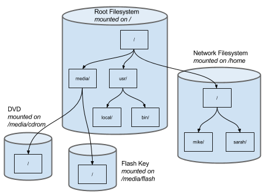
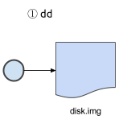
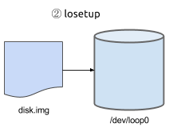
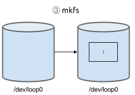
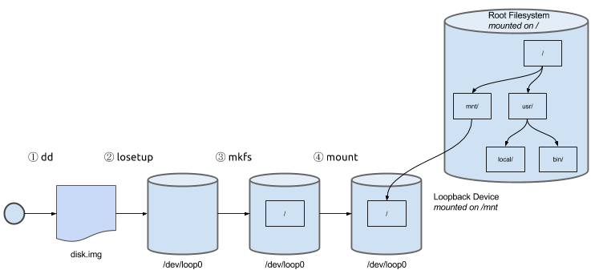

### Commands 

  * mount
  * umount
  * losetup
  * dd
  * mkfs

### Configuration 

  * /etc/fstab

## Introduction 

Linux's filesystem is a filesystem of filesystems. A filesystem is an entity that contains files and can be on physical disks, disk arrays or on the network. In order for filesystems to be useful they must be formatted and mounted. This page explain those relationships and show you the commands you need to manage and manipulate filesystems.

## The Logical Filesystem  


In Depth:[Navigating the Filesystem](navigating_the_filesystem)

As a Linux user you should be familiar with the unified filesystem and how to navigate it. A simplified diagram of the filesystem is on the right. The diagram shows a typical layout of directories. By following the arrows in the diagram you can build an absolute path. For example, if you wanted to find where my files are you would:

```
$ cd / 
$ cd home
$ cd mike
```

At the end of the process you will have constructed the path:

```
/ + home/ + mike/
/home/mike/
```

This understanding is all a regular user needs. An administrator, however is concerned with where these paths are stored physically or on the network and what format the filesystems use.

## The Physical Filesystem 



There are invisible boundaries in the logical filesystem. Those boundaries are where different storage media have been mounted into the file tree. Examine the drawing on the right. In that drawing the same folders as above are shown but grouped together with the disk or network share that contains the files. The diagram shows that the logical filesystem is composed of four physical filesystems.

  - The root filesysem (/) mounted on ``/``
  - A network filesystem with home directories mounted on ``/home``
  - A DVD mounted on ``/media/cdrom``
  - A flash drive mounted on ``/media/flash``

One thing you should notice is that each physical filesystem has a root (``/``) directory. The location of the root directory in the logical filesystem is determined by where it is mounted.In the example the network filesystem that contains ``mike/`` and ``sarah/`` happens to be mounted on ``/home``. As an administrator you are free to mount it anywhere you like, even into another mounted filesystem.

## Filesystem Types 

The term "filesystem" can refer to two things. A bunch of files and directories organized into a tree structure or the on-disk format used to store data. The two uses make the work confusing for beginners. The table describes some filesystem formats that are supported by Linux:

| Filesystem Format | mount flag | Use | Description |
| --- | --- | --- | --- |  
| ext2, ext3, ext4 | -t ext4 | Native Linux disks | The EXT family of filesystems have been Linux's native filesystems for almost as long as there's been Linux. All machines you encounter in 2017 will use an EXT filesystem in at least one place. | 
| btrfs | -t btrfs | Native Linux disks | The B-Tree filesystem (pronounced butter-F-S) is an advanced filesystem that will replace the EXT family as Linux's primary filesystem. | 
| msdos, vfat | -t vfat | Flash and other removable drives | The DOS filesystem is very common for removable drives. It's lack of security are preferred for removable drives because user accounts don't have to be shared from machine to machine. | 
| NTFS | -t ntfs | Windows System Disks | NTFS is an advanced filesystem used by Windows | 
| HFS+ | -t hfsplus | OS X System Disks | HFS+ is an advanced filesystem used by Mac OS X | 
| ISO-9660 | -t iso9660 | CD/DVD ROM/R/RW disks | ISO-9660 is the standard filesystem for optical disks. It's used by CD and DVD drives (but not audio CDs). | 

There are many, many more formats supported by Linux. In fact, Linux supports more different formats out of the box than any other operating system. That's what makes Linux an excellent choice for data recovery and digital forensics.

## Block Devices 

A block device is a Linux device that is capable of holding a filesystem. Block devices get their name because they are devices where Linux is only allowed to read or write a block of data, rather than single bytes. The size of the block depends on the device but, for disks, is usually about 4k bytes of data. Block devices (like all devices) are found in the /dev directory:

```
$ ls -l /dev
total 0
crw-------  1 root root     10, 235 Sep 10 09:22 autofs
crw-------  1 root root     10, 234 Sep 10 09:22 btrfs-control
drwxr-xr-x  3 root root          60 Sep 10 09:22 bus
lrwxrwxrwx  1 root root           3 Sep 10 09:22 cdrom -> sr0
crw-------  1 root root      5,   1 Sep 10 09:23 console
lrwxrwxrwx  1 root root          11 Sep 10 09:22 core -> /proc/kcore
drwxr-xr-x  2 root root          60 Sep 10 09:22 cpu
crw-------  1 root root     10,  60 Sep 13 09:47 cpu_dma_latency
brw-rw----  1 root disk    252,   0 Sep 10 09:22 dm-0
brw-rw----  1 root disk    252,   1 Sep 10 09:22 dm-1
brw-rw----  1 root disk    252,   2 Sep 10 09:22 dm-2
drwxr-xr-x  2 root root          80 Sep 10 09:22 dri
crw-rw----  1 root video    29,   0 Sep 10 09:22 fb0
lrwxrwxrwx  1 root root          13 Sep 10 09:22 fd -> /proc/self/fd
crw-rw-rw-  1 root root      1,   7 Sep 10 09:22 full
crw-rw-rw-  1 root root     10, 229 Sep 13 09:47 fuse
crw-------  1 root root    249,   0 Sep 10 09:22 hidraw0
crw-------  1 root root     10, 228 Sep 13 09:47 hpet
drwxr-xr-x  4 root root         460 Sep 10 09:22 input
crw-r--r--  1 root root      1,  11 Sep 10 09:22 kmsg
srw-rw-rw-  1 root root           0 Sep 10 09:22 log
brw-rw----  1 root disk      7,   0 Sep 10 09:22 loop0
brw-rw----  1 root disk      7,   1 Sep 10 09:22 loop1
brw-rw----  1 root disk      7,   2 Sep 10 09:22 loop2
brw-rw----  1 root disk      7,   3 Sep 10 09:22 loop3
brw-rw----  1 root disk      7,   4 Sep 10 09:22 loop4
brw-rw----  1 root disk      7,   5 Sep 10 09:22 loop5
brw-rw----  1 root disk      7,   6 Sep 10 09:22 loop6
brw-rw----  1 root disk      7,   7 Sep 10 09:22 loop7
crw-------  1 root root     10, 237 Sep 13 09:47 loop-control
crw-rw-rw-  1 root root      1,   8 Sep 10 09:22 random
brw-rw----  1 root disk      8,   1 Sep 10 09:22 sda1
brw-rw----  1 root disk      8,   2 Sep 10 09:22 sda2
brw-rw----  1 root disk      8,   5 Sep 10 09:22 sda5
brw-rw----  1 root disk      8,  16 Sep 10 09:22 sdb
crw-rw----  1 root disk     21,   0 Sep 10 09:22 sg0
crw-rw----  1 root disk     21,   1 Sep 10 09:22 sg1
lrwxrwxrwx  1 root root          15 Sep 10 09:22 stderr -> /proc/self/fd/2
lrwxrwxrwx  1 root root          15 Sep 10 09:22 stdin -> /proc/self/fd/0
lrwxrwxrwx  1 root root          15 Sep 10 09:22 stdout -> /proc/self/fd/1
crw-------  1 tss  tss      10, 224 Sep 13 09:47 tpm0
crw-rw-rw-  1 root tty       5,   0 Sep 18 09:45 tty
crw--w----  1 root tty       4,   0 Sep 10 09:22 tty0
crw-rw----  1 root tty       4,   1 Sep 10 09:23 tty1
```

The output of ls has been shortened and the block devices are highlighted in bold. Notice that each of the block devices has a "b" as the first character of ls's output.

## Creating a Block Device with losetup 



If you want to practice formatting, mounting and unmounting disks and you don't have hard drives to spare you can create virtual block devices using the ``losetup``command. The ``losetup`` command creates a block device inside of a file. The file can be located anywhere. If you plan on using virtualization ``losetup`` is an extremely handy utility. In order to use it you must first have a file. The ``dd`` command is like the ``cp`` command but it gives you precise control over how data is copied. The following ``dd`` command creates a 10M byte file called ``disk.img``

```
$ dd if=/dev/zero of=disk.img bs=1M count=10
$ ls -la disk.img
-rw-rw-r-- 1 mike mike 10485760 Sep 19 12:29 disk.img
```

Here's a quick explanation of what dd just did:
  * ``if=/dev/zero``: The ``if`` argument is "input file" this reads data from the file /dev/zero, a special device that's always reads zeros.
  * ``of=disk.img``: The ``of`` argument is "output file" this writes to our file disk.img
  * ``bs=1M``: The bs argument is "block size". Block size is the number of bytes copied in each copy operation.
  * ``count=10``: The count argument is how many copy operations to perform. The amount of data copied will be (``bs * count``)



Now you use losetup to bind that file to the block device ``/dev/loop0``:

```
$ sudo losetup /dev/loop0 disk.img
$ sudo losetup /dev/loop0
/dev/loop0: [fc01]:48234514 (/tmp/disk.img)
```

If you've done the losetup correctly running it with only the loop device as an argument will show you what file is bound to the loop device. If not you will see something like this:

```
$ sudo losetup /dev/loop0
loop: can't get info on device /dev/loop0: No such device or address
```

The loopback devices are special devices that can only be used with losetup. If you look at the contents of the ``/dev`` directory above you can see the loopback devices in there. They are ``/dev/loop*``.

```
$ ls -l /dev/loop*
total 0
brw-rw---- 1 root disk 7, 0 Sep 10 09:22 loop0
brw-rw---- 1 root disk 7, 1 Sep 10 09:22 loop1
brw-rw---- 1 root disk 7, 2 Sep 10 09:22 loop2
brw-rw---- 1 root disk 7, 3 Sep 10 09:22 loop3
brw-rw---- 1 root disk 7, 4 Sep 10 09:22 loop4
brw-rw---- 1 root disk 7, 5 Sep 10 09:22 loop5
brw-rw---- 1 root disk 7, 6 Sep 10 09:22 loop6
brw-rw---- 1 root disk 7, 7 Sep 10 09:22 loop7
```

## Formatting Block Devices 



Before we can mount a block device it must have a format. Flash keys and other removable media are usually shipped with a format on them, that way they're ready to use out of the box. Hard disks, however, are not typically formatted. If you followed the instructions above your loopback device has no format. After all, it contains a bunch of zeros. In this step we'll use mkfs to create an ext4 filesystem.

One important thing to remember is that mkfs and related commands only work on block devices, they do not work on files. The purpose of losetup was to make a block device out of a file. Now that we have that you must remember to use the loopback device (`/dev/loop0`) and not the filename (`disk.img`).

```
$ sudo mkfs -t ext4 /dev/loop0
mke2fs 1.42.9 (4-Feb-2014)
Discarding device blocks: done              
Filesystem label=
OS type: Linux
Block size=1024 (log=0)
Fragment size=1024 (log=0)
Stride=0 blocks, Stripe width=0 blocks
2560 inodes, 10240 blocks
512 blocks (5.00%) reserved for the super user
First data block=1
Maximum filesystem blocks=10485760
2 block groups
8192 blocks per group, 8192 fragments per group
1280 inodes per group
Superblock backups stored on blocks:
8193
Allocating group tables: done              
Writing inode tables: done              
Creating journal (1024 blocks): done
Writing superblocks and filesystem accounting information: done
```

The format process is quick, it only writes the data structures needed to access the disk. The first few blocks of the disk contains a data structure called the superblock. The superblock tells Linux what kind of filesystem is in the block device. Use the hexdump command to look at the contents of the superblock:

```
$ sudo hexdump -n 2048 -C /dev/loop0
00000000 00 00 00 00 00 00 00 00 00 00 00 00 00 00 00 00 |................|
*
00000400 00 0a 00 00 00 28 00 00 00 02 00 00 5b 22 00 00 |.....(......["..|
00000410 f5 09 00 00 01 00 00 00 00 00 00 00 00 00 00 00 |................|
00000420 00 20 00 00 00 20 00 00 00 05 00 00 00 00 00 00 |. ... ..........|
00000430 d1 be fd 55 00 00 ff ff 53 ef 01 00 01 00 00 00 |...U....S.......|
00000440 d1 be fd 55 00 00 00 00 00 00 00 00 01 00 00 00 |...U............|
00000450 00 00 00 00 0b 00 00 00 80 00 00 00 3c 00 00 00 |............<...|
00000460 42 02 00 00 79 00 00 00 a5 5e de 48 67 fe 43 4d |B...y....^.Hg.CM|
00000470 95 77 70 a3 ec be 60 41 00 00 00 00 00 00 00 00 |.wp...`A........|
00000480 00 00 00 00 00 00 00 00 00 00 00 00 00 00 00 00 |................|
```

Hexdump can look at files too. Run this command and notice that the contents of disk.img and `/dev/loop0` are identical.

```
$ hexdump -n 2048 -C disk.img
```

Notice you don't have to be root to look at disk.img. You can overwrite the ext4 format by executing the mkfs command again. You may need to install software to format your disk. To see what mkfs commands you have installed run this command:

```
$ ls /sbin/mkfs*
/sbin/mkfs     /sbin/mkfs.ext2   /sbin/mkfs.fat  /sbin/mkfs.vfat
/sbin/mkfs.bfs   /sbin/mkfs.ext3   /sbin/mkfs.minix
/sbin/mkfs.btrfs  /sbin/mkfs.ext4   /sbin/mkfs.msdos
/sbin/mkfs.cramfs /sbin/mkfs.ext4dev /sbin/mkfs.ntfs
```

If you are missing some formats you can install them with the following commands:

```
$ sudo apt-get install btrfs-tools
$ sudo apt-get install ntfs-3g
$ sudo apt-get install hfsutils hfsplus
```

Try creating a different format (like vfat, btrfs or ntfs), then look at the superblock.

## Mounting Filesystems with mount 


Formatting a block device places an empty filesystem on the device. An empty filesystem contains only a root directory (if it's an ext filesystem it also contains a directory called lost+found/). In order to access the storage on the block device you must mount it into the logical file tree. That's the job of the mount command. The mount command takes at least two arguments:

```
mount <what-to-mount:block-device> <where-to-mount-it:directory>
```

What to mount is a block device. The block device must contain a valid format. Usually mount is able to guess the format from looking at the superblock. In come cases it can't so you'll have to tell mount what format to use:

```
mount -t <filesystem-type> <what> <where>
```

Where to mount is where you want to place the block device into the logical file tree. The files and directories inside of the block device become accessible starting in the directory where you mount them. Mount the loopback device from the previous steps with the command:

```
$ sudo mount /dev/loop0 /mnt
```

The `/mnt` directory is not special. It's a useful place to mount temporary filesystems. You can mount your filesystem anywhere. However, if you mount your filesystem "over" a directory that's already in use you may cause the system to become unstable. Consider this:

```
# don't do this!!!
$ sudo mount /dev/loop0 /bin
```

That command places the contents of your empty loop device in the place of `/bin`. The original contents of `/bin` are not lost but you can no longer access them. That's a big problem because you won't be able to run `mount` (or `umount`) anymore. The only way out of the hole you just made is to reboot.

### Making Mounts Permanent 

The mount command only affects the in-memory state of Linux. If you reboot any changes you've made will be lost unless you save them into `/etc/fstab` file. The `/etc/fstab` (filesystem table) file is read at system boot time. Every line in the file tells Linux what to mount. The format of the file is:

```
<file system> <mount point> <type> <options> <dump> <pass>
```

The first four fields become options to mount. If your `/etc/fstab` file contained the following line:

```
/dev/loop0 /mnt ext4 ro 0 0
```

The mount command that runs at startup would be:

```
$ mount -t ext4 -o ro /dev/loop0 /mnt
```

The `-o` argument is for adding options to the mount. Different filesystems use different options. The `ro` option specified here means Read-Only. The `<dump>` and `<pass>` fields control backups and filesystem checks respectively. They are mostly there for historical reasons. It's safe to leave them both 0. Here's what Ubuntu's default `/etc/fstab` looks like:

```
# /etc/fstab: static file system information.
#
# Use 'blkid' to print the universally unique identifier for a
# device; this may be used with UUID= as a more robust way to name devices
# that works even if disks are added and removed. See fstab(5).
#
# <file system> <mount point>  <type> <options>    <dump> <pass>
/dev/mapper/ubuntu--vg-root /        ext4  errors=remount-ro,relatime,discard 0    1
# /boot was on /dev/sda1 during installation
UUID=0d2549a5-db4d-4f6a-bb19-9304bd76d0e1 /boot      ext2  defaults,relatime,discard    0    2
/dev/mapper/ubuntu--vg-swap_1 none      swap  sw       0    0
```

Notice the `UUID=XXXXXXXX` field? Every filesystem gets a unique ID when it's formatted. That line specifies a filesystem by it's ID rather than the device it's on. Linux can find that filesystem even after you've moved disks around.It prevents a common cause of an unbootable system.

### Knowing What's Mounted 

The `mount` command will tell you what filesystems are currently mounted:

```
$ mount
/dev/mapper/ubuntu--vg-root on / type ext4 (rw,relatime,errors=remount-ro,discard)
proc on /proc type proc (rw,noexec,nosuid,nodev)
sysfs on /sys type sysfs (rw,noexec,nosuid,nodev)
none on /sys/fs/cgroup type tmpfs (rw)
none on /sys/fs/fuse/connections type fusectl (rw)
none on /sys/kernel/debug type debugfs (rw)
none on /sys/kernel/security type securityfs (rw)
udev on /dev type devtmpfs (rw,mode=0755)
devpts on /dev/pts type devpts (rw,noexec,nosuid,gid=5,mode=0620)
tmpfs on /run type tmpfs (rw,noexec,nosuid,size=10%,mode=0755)
none on /run/lock type tmpfs (rw,noexec,nosuid,nodev,size=5242880)
none on /run/shm type tmpfs (rw,nosuid,nodev)
none on /run/user type tmpfs (rw,noexec,nosuid,nodev,size=104857600,mode=0755)
none on /sys/fs/pstore type pstore (rw)
cgroup on /sys/fs/cgroup/cpuset type cgroup (rw,relatime,cpuset)
cgroup on /sys/fs/cgroup/cpu type cgroup (rw,relatime,cpu)
cgroup on /sys/fs/cgroup/cpuacct type cgroup (rw,relatime,cpuacct)
cgroup on /sys/fs/cgroup/memory type cgroup (rw,relatime,memory)
cgroup on /sys/fs/cgroup/devices type cgroup (rw,relatime,devices)
cgroup on /sys/fs/cgroup/freezer type cgroup (rw,relatime,freezer)
cgroup on /sys/fs/cgroup/blkio type cgroup (rw,relatime,blkio)
cgroup on /sys/fs/cgroup/perf_event type cgroup (rw,relatime,perf_event)
cgroup on /sys/fs/cgroup/hugetlb type cgroup (rw,relatime,hugetlb)
/dev/sda1 on /boot type ext2 (rw,relatime,discard)
binfmt_misc on /proc/sys/fs/binfmt_misc type binfmt_misc (rw,noexec,nosuid,nodev)
rpc_pipefs on /run/rpc_pipefs type rpc_pipefs (rw)
systemd on /sys/fs/cgroup/systemd type cgroup (rw,noexec,nosuid,nodev,none,name=systemd)
/home/mike/.Private on /home/mike type ecryptfs (ecryptfs_check_dev_ruid, ecryptfs_cipher=aes, ecryptfs_key_bytes=16, ecryptfs_unlink_sigs, ecryptfs_sig=cae3aa035a2adbee, ecryptfs_fnek_sig=34945104756e4f75)
gvfsd-fuse on /run/user/1000/gvfs type fuse.gvfsd-fuse (rw,nosuid,nodev,user=mike)
```

That's a lot more than what's in `/etc/fstab`! I'll explain the results in groups. Most of the mounts you see are not physical devices. They're virtual devices that contain files.
Physical Devices. These are the devices that correspond to the ones in `/etc/fstab`

```
/dev/mapper/ubuntu--vg-root on / type ext4 (rw,relatime,errors=remount-ro,discard)
/dev/sda1 on /boot type ext2 (rw,relatime,discard)
```

Special filesystems for communication with the kernel. These filesystems contain files that are a way for user programs to communicate with the kernel. Each type has one has it's own use.

```
proc on /proc type proc (rw,noexec,nosuid,nodev)
sysfs on /sys type sysfs (rw,noexec,nosuid,nodev)
udev on /dev type devtmpfs (rw,mode=0755)
devpts on /dev/pts type devpts (rw,noexec,nosuid,gid=5,mode=0620)
```

Temporary Filesystems. The tempfs filesystem is an in-memory filesystem or ramdisk.

```
none on /sys/fs/cgroup type tmpfs (rw)
tmpfs on /run type tmpfs (rw,noexec,nosuid,size=10%,mode=0755)
none on /run/lock type tmpfs (rw,noexec,nosuid,nodev,size=5242880)
none on /run/shm type tmpfs (rw,nosuid,nodev)
none on /run/user type tmpfs (rw,noexec,nosuid,nodev,size=104857600,mode=0755)
```

FUSE filesystems. FUSE statnds for Filesystem in USErspace. FUSE is a way for regular Linux programs to perform the job of a filesystem driver. FUSE makes it possible to do transparent encryption on your home directory.

```
none on /sys/fs/fuse/connections type fusectl (rw)
/home/mike/.Private on /home/mike type ecryptfs (ecryptfs_check_dev_ruid, ecryptfs_cipher=aes, ecryptfs_key_bytes=16, ecryptfs_unlink_sigs, ecryptfs_sig=cae3aa035a2adbee, ecryptfs_fnek_sig=34945104756e4f75)
gvfsd-fuse on /run/user/1000/gvfs type fuse.gvfsd-fuse (rw,nosuid,nodev,user=mike)
```

Using files and directories as a mechanism to manipulate the Linux kernel has gained in popularity, causing a large increase in the number of mounted virtual filesystems. When kernel controls and information are available as files it gives programmers a very simple and understandable way to read and alter them. The most complicated configuration tasks can easily be done with a BASH script.

## Unmount and Unbind 

Now that you've seen the process it's time to reverse it. In order to reverse the process you must work backwards from the mounted state. Skipping steps will cause errors. First unmount the loopback device with ``umount``. The ``umount`` command takes either a device or a path as its argument.

```
umount <device>
umount <mountpoint>
```

Therefore you can say either:

```
$ sudo umount /dev/loop0
$ sudo umount /mnt
```

Not both! Linux will refuse to unmount a filesystem that is in use because doing so would cause programs to crash. If your working directory is in your device mount will fail because cd-ing into the device counts as use. Once you have successfully unmounted you unbind the loopback device:

```
$ sudo losetup -d /dev/loop0
```

The ``-d`` argument is "detach". After that the file and the loopback device are no longer associated.

## Summary 



In this lesson you created a file and bound that file to a loopback device which you formatted and mounted. The process is shown in the image on the right. At the end of the lesson you should have unmounted and unbound the device. That leaves you the file. The still contains the filesystem you created and the files in it. Having a so-called image file can be quite useful.
