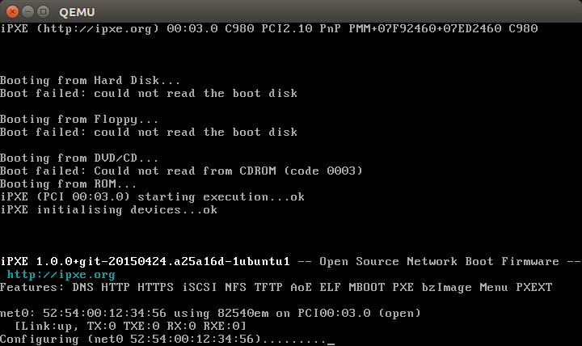

# Introduction  

There are several ways to host virtual machines on Linux. The most popular tool ``qemu`` will be discussed in this lecture. 

# Qemu  

Qemu is an emulator. It's able to run code for different processors than the host processor. So, you could emulate your mobile phone on you're PC. Qemu can be downloaded from here: 

https://www.qemu.org/

But, it's better to install it from packages on Linux:

```
$ sudo apt install qemu-system qemu-kvm
```
 
Qemu is important because it can emulate a foreign (or native) machine. Another component called KVM uses the hardware in modern processors that enables virtualization to hugely speed up the emulation of native code. KVM is the official Linux virtualization solution and can be found here: 

https://www.linux-kvm.org/page/Main_Page

In order for KVM to work you must have virtualization hardware enabled. It's possible to run a VM inside of a VM. You can enable that option in VMware but it's not necessary. You can always do software emulation, it's just slower. 

# Starting the Emulator  

If you're running on a desktop machine qemu comes with a GUI. Running the ``qemu-system-x86_64`` command starts it:

```
$ qemu-system-x86_64 
```
  
Here's what the GUI looks like: 



It's a full fledged virtual machine!

## Testing Kernels  

One of the important features of qemu is the ability to test the kernel you just made. First you need to get qemu to work on the command line (without a GUI). 

```
$ qemu-system-x86_64 -m 1024 -nographic -serial mon:stdio -kernel <kernel-file> -initrd <initrd-file> -append console=ttyS0
```
 
## Using KVM  

You can see if your processor supports virtualization by looking in `/proc/cpuinfo`:

```
$ grep -E '(vmx|svm)' /proc/cpuinfo
```

If you processor supports virtualization you can verify that the modules are loaded: 

```
$ lsmod | grep kvm 
```

If both of those are true you can add the ``-enable-kvm`` flag to qemu:

```
$ qemu-system-x86_64 -m 1024 -nographic -serial mon:stdio -kernel <kernel-file> -initrd <initrd-file> -append console=ttyS0 -enable-kvm
```
